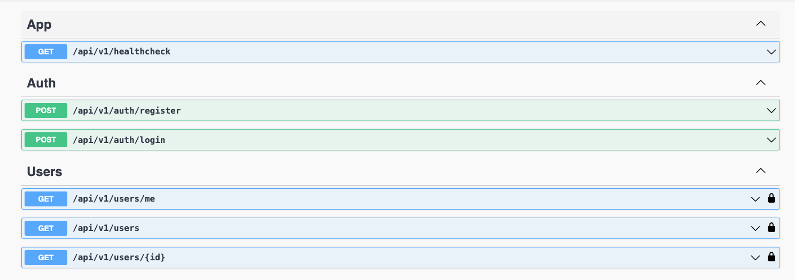

# 🚀 NestJS Architecture!

This project serves as a robust and scalable foundational architecture for building a modern NestJS application. It comes pre-configured with essential features and best practices, allowing developers to focus on building business logic rather than spending time on initial setup. The architecture is designed to be modular, maintainable, and easily extensible, making it ideal for both small-scale applications and large enterprise solutions.

### 🔍 Key features include:

- 🧩 **Modular Structure:** Organized into feature-based modules, promoting separation of concerns and reusability across different parts of the application.
- 🗄️ **Database Integration:** Seamless integration with PostgreSQL, including pre-configured TypeORM support for efficient database interaction, along with migration management to handle schema changes.
- ⚡ **Redis Integration:** Pre-configured Redis support for caching and real-time data processing needs.
- 🔐 **Authentication and Authorization:** Built-in JWT-based authentication module to handle user sessions securely, including registration, login, and user management APIs.
- 📄 **API Documentation:** Auto-generated API documentation using NestJS DTOs. Additionally, in another branch called `main-custom-swagger`, the project includes a custom Swagger implementation with details available in the `libs/swagger` folder.
- 🛡️ **Validation and Error Handling:** Utilizes `class-validator` for easy validation through decorators, alongside custom exceptions with tailored messages and validation responses to ensure robust error handling.
- 🐳 **Docker Support:** Ready-to-use Docker and Docker Compose configurations for containerized deployment, ensuring consistency across different environments.
- ☁️ **AWS Integration:** Built-in support for AWS SNS and SQS, offering powerful tools for asynchronous communication and event-driven architectures. (AWS integration is disabled by default. It can be activated within the `global.module`.)

## 🗂️ Project Structure

- **`libs/` :**

  - This folder contains shared libraries generated using the NestJS CLI command `nest g library LIB_NAME`. These libraries can be reused across different modules in the application, promoting modularity and code reuse.

  - **`common/` :**

    - Contains shared utilities and components that are used across various modules in the application.

    - **`constants/`:** Contains constant values used throughout the application, such as configurations and settings

    - **`decorators/`:** Houses custom decorators that simplify and enhance the functionality of your code.

    - **`dtos/`:** Contains shared Data Transfer Objects (DTOs) used across multiple modules.

    - **`enums/`:** Stores enumerations that define a set of named constants, which can be used to represent a collection of related values in a type-safe manner.

    - **`exceptions/`:** Contains custom exceptions that extend the standard NestJS exceptions, providing more specific error handling across the application.

    - **`guards/`:** Includes custom guards that control access to routes based on certain conditions.

    - **`interceptors/`:** Houses custom interceptors that modify incoming requests or outgoing responses, such as logging, transformation, or error handling.

    - **`pipes/`:** Contains custom pipes that transform or validate data before it is processed by the controller. Pipes can be used for tasks like data validation, parsing, or formatting.

    - **`transformers/`:** Includes transformers that modify data between different layers of the application.

    - **`utils/`:** Stores utility functions and helpers that provide reusable functionality across the application, such as formatting dates, generating tokens, or handling common logic.

  - **`database/` :**

    - **`postgres/` :**

      - Contains configurations and setup for PostgreSQL integration, including TypeORM support and migration management.

      - **`entities/`:** Houses TypeORM entity definitions that map to database tables. These entities define the structure of your database and are used by TypeORM to perform CRUD operations. Each entity represents a model in your application and is directly tied to a specific database table.

      - **`migrations/`:** Contains migration files that handle changes to the database schema. Migrations can be generated using the command `npm run migrations:generate --name=MIGRATION_NAME`.

    - **`redis/` :**
      - Contains configuration and setup for Redis integration. Redis is used for caching and real-time data processing. This folder includes setup files to integrate Redis into the application, enhancing performance and enabling features like session management and caching.

  - **`swagger/`:**
    - **`modules/`**: Contains Swagger configurations for different modules.
      - **`auth/`**: Swagger configurations for the authentication module.
      - **`users/`**: Swagger configurations for the users module.
    - **`responses/`**: Defines custom Swagger responses for different HTTP statuses.
      - `forbidden.ts`: Swagger response for 403 Forbidden status.
      - `not-found.ts`: Swagger response for 404 Not Found status.
      - `success.ts`: Swagger response for successful operations.
      - `unauthorized.ts`: Swagger response for 401 Unauthorized status.
    - `config.ts`: Contains Swagger configuration settings.
    - `index.ts`: Entry point for the Swagger configuration.
    - `utils.ts`: Utility functions for Swagger configuration.
    - `tsconfig.lib.json`: TypeScript configuration specific to the Swagger library.

- **`src/` :**

  - The `src` folder is the core of the application. It contains the main application entry point and the organization of various features through modules.

  - **`main.ts:`** This file is the entry point of the NestJS application. It initializes the NestJS application by creating an instance of the `NestFactory` and setting up the application module. It is responsible for bootstrapping the entire application and configuring global settings, such as middlewares and exception filters.

  - **`modules/` :** Houses all the application modules, each encapsulating a specific feature or domain of the application. Modules in this folder adhere to the modular design principles of NestJS, promoting separation of concerns and code reusability. Each module typically includes its own set of controllers, services, and providers, organizing related functionality and business logic into cohesive units.

- **`docker/`:**

  - Contains configuration files and scripts related to Docker for containerizing the application.

  - **`Dockerfile:`** Defines the steps for building a Docker image for the application. It includes instructions to set up the environment, install dependencies, copy source files, and configure the application for running inside a Docker container. This file is used to create a consistent and reproducible build environment for the application.

- **`docker-compose.yml` :**

  - Defines a multi-container Docker application setup. It includes services for the NestJS application (`app`), PostgreSQL database (`postgres`), and database migrations (`postgres_migrations`). The file manages container dependencies, environment configurations, and networking, facilitating easy deployment and orchestration of the application and its associated services.

- **`.env.example`:**

  - Provides a template for environment variables required by the application. It includes placeholders for necessary configuration values such as database credentials, JWT secrets, and other settings. This file serves as a reference for creating the actual `.env` file with appropriate values for different environments (development, testing, production).

- **`.eslintrc.js` :**

  - Configures ESLint for linting JavaScript/TypeScript code. It defines rules and settings for code quality and style enforcement, ensuring consistent and error-free code across the project.

- **`.prettierrc.js` :**
  - Configures Prettier for code formatting. It specifies formatting options such as indentation, line width, and quote style, ensuring that code adheres to a consistent format throughout the project.

## 📝 Note on `NOTE`

Throughout the project, you will encounter `NOTE` comments that provide important context or instructions. These comments are intended to guide developers in understanding key parts of the code, configuration, and best practices.

## 💻 Prerequisites:

Ensure you have the following tools installed in your PC:

- NodeJS (along with npm)
- NestJS
- Postgres

## 🚀 Run project:

1. Clone the repository:

```sh
git clone https://github.com/grishahovhanyan/nestjs-architecture.git
```

2. Navigate to the project directory:

```sh
cd nestjs-architecture
```

3. Run the following command to install all dependencies:

```sh
npm install
```

4. Create a .env file from the provided .env.example file.

```sh
cp .env.example .env
```

5. To run migrations, use the following command:

```sh
npm run migrations:run
```

6. To run the development environment, use the following command:

```sh
npm run start:dev
```

After starting the server, you can access the application at: http://localhost:PORT_FROM_ENV/swagger-ui/

## 🐳 Run project with docker:

1. After clone go to the project directory and create a .env file from the provided .env.example file.

```sh
cp .env.example .env
```

2. Build a Docker image for project using the Dockerfile located in the "docker" directory.

```sh
docker build . -f docker/Dockerfile
```

3. Run a Docker container using the image created in the previous step.

```sh
docker run --entrypoint /usr/src/app/docker/entrypoint.sh -it IMAGE_ID_FROM_PREVIOUS_STEP /usr/src/app/docker/start_node.sh
```

## 🐳 Run project with docker compose:

1. After clone go to the project directory and create a .env file from the provided .env.example file.

```sh
cp .env.example .env
```

2. Build Docker images for a multi-container application defined in a Docker Compose file.

```sh
docker compose up --build
```

3. Run Docker containers based on the images created in the previous step.

```sh
docker compose up
```

## ✏️ API V1 Endpoints

- **Healthcheck:** `GET /healthcheck/`

- **Register:** `GET /auth/register/`
- **Login:** `GET /auth/login/`

- **Get current user:** `GET /users/me/`
- **Get users:** `GET /users/`
- **Get user by Id:** `GET /users/:id/`



## 🗂️ NPM Commands

- **`npm run format`**: Formats TypeScript files in the `src`, `test`, and `libs` directories according to the rules defined in the `.prettierrc.js` configuration file.

- **`npm run lint`**: Executes ESLint to check for code quality issues and ensure that the code adheres to the defined coding standards.

- **`npm run build`**: Compiles TypeScript files into JavaScript and outputs the results into the `dist` folder, preparing the application for deployment.

- **`npm run start`**: Starts the NestJS application in production mode using the compiled files from the `dist` folder.

- **`npm run start:dev`**: Launches the application in development mode with live reloading enabled, automatically restarting the server when changes are detected.

- **`npm run start:debug`**: Runs the application in debug mode with live reloading, allowing for debugging and step-by-step code execution.

- **`npm run start:prod`**: Starts the compiled production-ready application using Node.js, running the code from the `dist/main` file.

- **`npm run typeorm`**: Runs TypeORM CLI commands using `ts-node` to handle database-related tasks, such as running migrations, without needing to compile TypeScript code first.

- **`npm run migrations:create`**: Creates a new migration file in the specified `migrations` directory, which can be used to define database schema changes.

- **`npm run migrations:generate`**: Automatically generates a migration file based on the current state of the entities, capturing any schema changes that need to be applied to the database.

- **`npm run migrations:run`**: Applies all pending migrations to the database, updating the schema according to the latest migration files.

- **`npm run migrations:rollback`**: Reverts the last migration that was applied, rolling back the database schema to the previous state.

## 🗂️ NestJS CLI Commands

- **`nest g module MODULE_NAME`**: Generates a new module in the application, creating a directory and file structure for the module.

- **`nest g service SERVICE_NAME`**: Generates a new service in the specified module, providing a class with dependency injection.

- **`nest g controller CONTROLLER_NAME`**: Generates a new controller in the specified module, enabling the creation of routes and request handlers.

- **`nest g class CLASS_NAME`**: Generates a new class in the specified directory, which can be used for utility functions, constants, or other shared logic.

- **`nest g library LIB_NAME`**: Generates a new library in the `libs/` folder, creating a reusable set of functionalities that can be shared across the application.

## 📝 Author

- **Grisha Hovhanyan** - [github:grishahovhanyan](https://github.com/grishahovhanyan)
